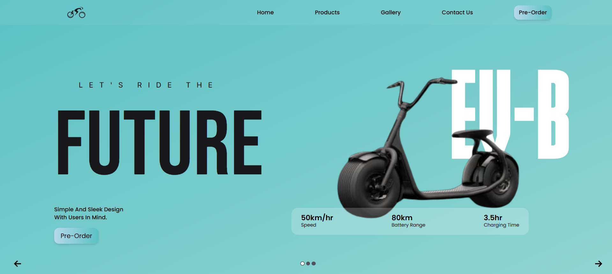
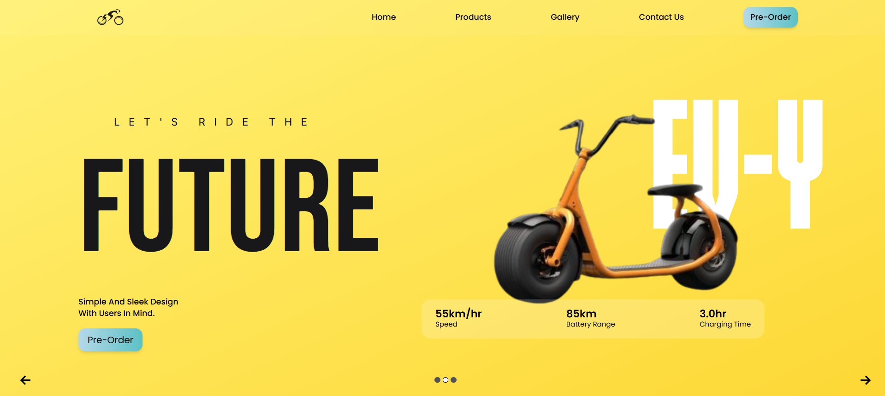
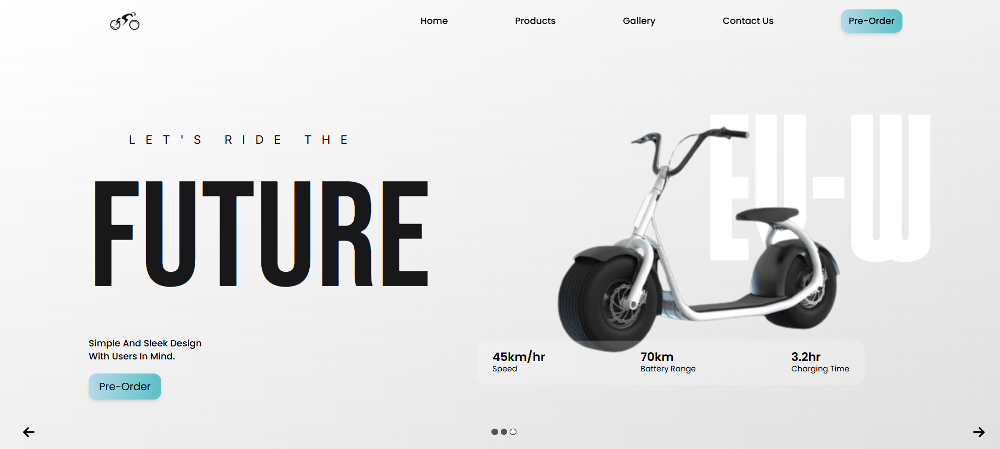
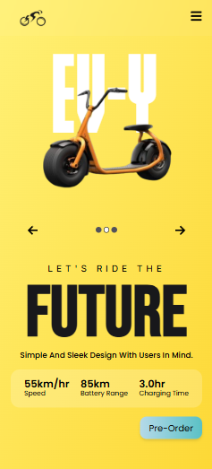

# ⚡ E-bike Website

A modern, animated landing page for showcasing electric scooter models. Built using **React**, **Tailwind CSS** and **GSAP**, this site offers a fully responsive user experience with smooth transitions, dynamic themes based on scooter models, and engaging UI animations.

> 🔧 **Project Status**: Complete (Responsive + Themed)

---

## ✨ Features

- ⚛️ Fully responsive layout for desktop and mobile devices
- 🎨 Multiple dynamic themes:
  - Main Theme (Black Scooter)
  - Yellow Theme
  - White Theme
- 🚴‍♂️ Smooth model transitions using **GSAP animations**
- 📱 Optimized mobile layout & performance
- 🌈 Theme-based UI color and style updates
- 🧠 Component-driven React architecture
- 💨 Utility-first styling with Tailwind CSS


## 🧰 Tech Stack

| Technology         | Description                          |
|--------------------|--------------------------------------|
| **React**          | Core framework                      |
| **Tailwind CSS**   | Utility-first CSS styling           |
| **GSAP**           | Advanced animations and transitions |


---

## 📸 Screenshots

### 🖥️ Desktop Views

#### 🎨 Main Theme (Default)


#### 💛 Yellow Theme


#### ⚪ White Theme


### 📱 Mobile Layout


---

## 🚀 Getting Started

To run this project locally:

```bash
# Clone the repository
git clone https://github.com/Mayank181006/E-bike-Website-.git

# Navigate into the project directory
cd E-bike-Website-

# Install dependencies
npm install

# Run the development server
npm run dev
```
Then, open your browser and go to `http://localhost:5173` (or the port shown in your terminal).

---
## 📄 License

This project is built for **educational and portfolio use only**.  
All design and branding used in demo content are fictional or sample.

---
## 🙌 Acknowledgements

Thanks to libraries like **GSAP** and **Tailwind CSS**  
for making creative frontend experiences easier and more fun.
---